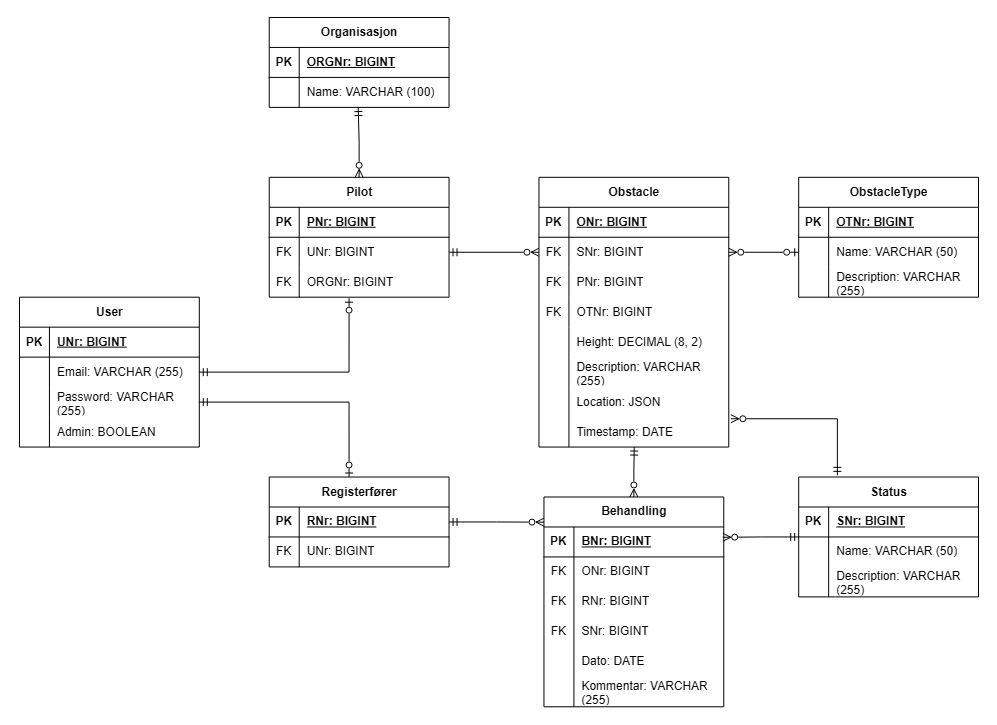

# NRL Webapplikasjon

En webapplikasjon for registrering og håndtering av luftfartshindre i Norge. Bygget med ASP.NET Core 9.0 MVC, Entity Framework Core 9.0, og MariaDB 10.11.

**Prosjektoppgave i IS-200 (UiA)**

---

## Innholdsfortegnelse

* [Om Prosjektet](#om-prosjektet)
* [Komme i Gang](#komme-i-gang)
* [Testing](#testing)
* [Database Design](#database-design)
* [Teknisk Dokumentasjon](#teknisk-dokumentasjon)
* [Sikkerhet](#sikkerhet)
* [Kjente Problemer](#kjente-problemer)
* [Feilsøking](#feilsøking)

---

## Om Prosjektet

Denne applikasjonen lar piloter registrere hindringer (master, stolper, antenner, etc.) som kan være farlige for luftfart. Systemet inkluderer en tredelt godkjenningsarbeidsflyt:

1. **Piloter** registrerer hindringer med lokasjonsdata
2. **Registerførere** vurderer og godkjenner/avviser innleveringer
3. **Administratorer** administrerer brukere og ser systemstatistikk

### Hovedfunksjoner

* Interaktivt kartbasert hindringregistrering (Leaflet.js med OpenStreetMap)
* Quick Register og Full Register arbeidsflyter
* Rollebasert tilgangskontroll med brukergodkjenning
* Godkjennings-/avvisningsarbeidsflyt med fullstendig historikk
* Responsiv design (fungerer på mobil og desktop)
* Content Security Policy (CSP) implementering
* Omfattende testsuite med xUnit og Moq
* Export til Excel via ClosedXML
* Flerspråkstøtte (Norsk/Engelsk)

---

## Komme i Gang

### Forutsetninger

#### 1. Docker Desktop (Påkrevd)

Docker kjører MariaDB-databasen i en container.

**Installasjon:**
1. Last ned fra https://www.docker.com/products/docker-desktop
2. Installer og start Docker Desktop
3. Vent til grønt ikon vises (Docker kjører)

**Systemkrav:**
* Windows 10 64-bit: Pro, Enterprise, eller Education (Build 19041+)
* ELLER Windows 11 64-bit
* WSL 2 aktivert

#### 2. .NET 9.0 SDK (Påkrevd)

**Installasjon:**
1. Last ned fra https://dotnet.microsoft.com/download/dotnet/9.0
2. Installer SDK (ikke bare Runtime)
3. Verifiser: `dotnet --version` (skal vise 9.0.x)

#### 3. Git (Påkrevd)

**Installasjon:**
1. Last ned fra https://git-scm.com/downloads
2. Installer med standard innstillinger

#### 4. Visual Studio 2022 eller VS Code (Anbefalt)

**Visual Studio 2022:**
- Profesjonell IDE med innebygd støtte for ASP.NET Core
- Beste valg for utvikling og debugging

**Visual Studio Code:**
- Lett koderedigerer
- Krever C# extension fra Microsoft

---

### Installasjonsguide

#### Steg 1: Klon Prosjektet

```bash
git clone https://github.com/kJ4SPer/NRLWebApp.git
cd NRLWebApp
```

#### Steg 2: Start Docker og Database

1. Åpne Docker Desktop og vent til det er klart
2. Start MariaDB-containeren:

```bash
docker-compose up -d
```

**Vent 15-20 sekunder** for at databasen skal starte fullstendig.

#### Steg 3: Installer Entity Framework Tools

```bash
dotnet tool install --global dotnet-ef
```

Hvis allerede installert, oppdater:

```bash
dotnet tool update --global dotnet-ef
```

#### Steg 4: Kjør Migrasjoner

```bash
cd FirstWebApplication
dotnet ef database update
```

Dette oppretter alle tabeller i databasen.

#### Steg 5: Bygg Applikasjonen

```bash
dotnet build
```

#### Steg 6: Kjør Applikasjonen

```bash
dotnet run
```

Applikasjonen starter på:
- **HTTPS:** https://localhost:7286
- **HTTP:** http://localhost:5112

---

### Database Seeding

Applikasjonen inkluderer `DatabaseSeeder.cs` som automatisk populerer databasen med testdata når den kjøres i Development-modus.

#### Seeding Prosess

Seeding utføres i følgende rekkefølge:

1. **Roller** - Oppretter Admin, Registerfører, og Pilot roller
2. **Organisasjoner** - Oppretter 6 standard organisasjoner
3. **StatusTyper** - Oppretter 4 status-typer (Registered, Pending, Approved, Rejected)
4. **ObstacleTypes** - Oppretter 8 hindre-typer (Mast, Tower, Power Line, etc.)
5. **Brukere** - Oppretter testkontoer + 10 tilfeldige piloter
6. **Hindringer** - Oppretter 50 test-hindringer med tilfeldige data

#### Testkontoer

DatabaseSeeder oppretter følgende testkontoer:

| Rolle | E-post | Passord | Organisasjon |
|-------|--------|---------|--------------|
| Admin | admin@test.com | Admin123! | Kartverket |
| Registerfører | reg@test.com | Reg123! | Kartverket |
| Pilot | pilot@test.com | Pilot123! | Luftambulansen |

**Merk:** Alle seed-brukere er automatisk godkjent (`IsApproved = true`).

#### Seed Organisasjoner

DatabaseSeeder oppretter følgende organisasjoner:

1. **Kartverket** - Offentlig kartmyndighet
2. **Luftambulansen** - Medisinsk lufttransport
3. **Luftforsvaret** - Militær luftfart
4. **Politiet** - Politi helikopter tjeneste
5. **Norsk Luftsportforbund** - Fritidsflying
6. **Privat** - Private piloter

#### Seed Hindre-typer

8 standard hindre-typer med definerte høyde-områder:

- **Mast** (10-500m)
- **Tower** (20-300m)
- **Power Line** (5-100m)
- **Wind Turbine** (50-250m)
- **Building** (10-200m)
- **Crane** (20-150m)
- **Bridge** (10-100m)
- **Other** (1-1000m)

---

## Testing

### Teststruktur

Prosjektet har en omfattende testsuite i `NRLWebApp.Tests`-katalogen med **324 enhetstester** totalt.

```
NRLWebApp.Tests/
├── Controllers/
│   ├── AdminControllerTests.cs         (81 tester)
│   ├── HomeControllerTests.cs          (12 tester)
│   ├── PilotControllerTests.cs         (154 tester)
│   └── RegisterforerControllerTests.cs (77 tester)
├── Security/
│   └── CspMiddlewareTests.cs           (8 tester)
├── Mocks/
│   ├── MockUserManager.cs
│   ├── MockRoleManager.cs
│   ├── MockLoggerFactory.cs
│   └── TestDbContext.cs
└── NRLWebApp.Tests.csproj
```

### Test Rammeverk

**Testverktøy:**
- **xUnit 2.9.2** - Test framework
- **Moq 4.20.72** - Mocking library
- **EF Core InMemory 8.0.11** - In-memory database for testing
- **Coverlet 6.0.2** - Code coverage
- **Visual Studio Test SDK 17.12.0** - Test runner

### Typer Tester

#### 1. Controller Enhetstester

**PilotControllerTests.cs** (154 tester)

Hovedkategorier:
- **RegisterType GET/POST** (7 tester)
  - `RegisterType_Get_WithApprovedUser_ReturnsView()`
  - `RegisterType_Get_WithUnapprovedUser_RedirectsToAccountPending()`
  
- **QuickRegister GET/POST** (12 tester)
  - `QuickRegister_Post_ValidGeometry_SavesToDatabase()`
  - `QuickRegister_Post_ValidGeometry_CreatesRegisteredStatus()`
  - `QuickRegister_Post_EmptyGeometry_ReturnsViewWithError()`
  - `QuickRegister_Post_UnapprovedUser_RedirectsToAccountPending()`

- **QuickRegisterApi POST** (8 tester)
  - `QuickRegisterApi_ValidGeoJSON_ReturnsOk()`
  - `QuickRegisterApi_InvalidJSON_ReturnsBadRequest()`

- **FullRegister GET/POST** (15 tester)
  - `FullRegister_Post_ValidData_CreatesObstacle()`
  - `FullRegister_Post_ValidData_CreatesPendingStatus()`
  - `FullRegister_Post_InvalidModelState_ReturnsView()`

- **CompleteQuickRegister GET/POST** (18 tester)
  - `CompleteQuickRegister_Get_ValidId_ReturnsView()`
  - `CompleteQuickRegister_Post_ValidData_UpdatesObstacle()`
  - `CompleteQuickRegister_Post_ValidData_ChangeStatusToPending()`

- **MyRegistrations** (25 tester)
  - `MyRegistrations_ReturnsUserObstaclesGroupedByStatus()`
  - `MyRegistrations_IncludesIncompleteQuickRegs()`
  - `MyRegistrations_FiltersByCurrentUser()`

- **Overview** (12 tester)
  - `Overview_WithValidId_ReturnsObstacleDetails()`
  - `Overview_WithInvalidId_ReturnsNotFound()`
  - `Overview_WithOtherUserObstacle_ReturnsNotFound()`

- **DeleteRegistration** (8 tester)
  - `DeleteRegistration_ValidId_DeletesObstacle()`
  - `DeleteRegistration_WithStatus_DeletesStatusHistory()`
  - `DeleteRegistration_InvalidId_ReturnsRedirect()`

- **Authorization Tests** (5 tester)
  - `AllControllerActions_RequireApproval_RedirectWhenUnapproved()`

**RegisterforerControllerTests.cs** (77 tester)

Hovedkategorier:
- **Dashboard** (8 tester)
  - `RegisterforerDashboard_ReturnsCorrectCounts()`
  - `RegisterforerDashboard_WithNoObstacles_ReturnsZeros()`

- **PendingObstacles** (12 tester)
  - `PendingObstacles_ReturnsOnlyPendingStatus()`
  - `PendingObstacles_ExcludesIncomplete()`
  - `PendingObstacles_OrdersByDateDesc()`

- **ApproveObstacle GET/POST** (20 tester)
  - `ApproveObstacle_Get_ValidId_ReturnsView()`
  - `ApproveObstacle_Post_ValidId_SetsApprovedStatus()`
  - `ApproveObstacle_Post_CreatesStatusHistory()`
  - `ApproveObstacle_Post_DeactivatesOldStatus()`

- **RejectObstacle GET/POST** (18 tester)
  - `RejectObstacle_Get_ValidId_ReturnsView()`
  - `RejectObstacle_Post_WithReason_SetsRejectedStatus()`
  - `RejectObstacle_Post_WithoutReason_ReturnsError()`

- **ApprovedObstacles** (9 tester)
  - `ApprovedObstacles_ReturnsOnlyApproved()`
  - `ApprovedObstacles_IncludesApproverInfo()`

- **RejectedObstacles** (10 tester)
  - `RejectedObstacles_ReturnsOnlyRejected()`
  - `RejectedObstacles_IncludesRejectionReason()`

**AdminControllerTests.cs** (81 tester)

Hovedkategorier:
- **Dashboard** (6 tester)
  - `AdminDashboard_ReturnsCounts()`
  - `AdminDashboard_WithNoUsers_ReturnsZeroCounts()`

- **ApproveUser** (15 tester)
  - `ApproveUser_ValidId_SetsApprovedTrue()`
  - `ApproveUser_InvalidId_ReturnsNotFound()`
  - `ApproveUser_AlreadyApproved_ReturnsRedirect()`

- **PendingUsers** (10 tester)
  - `PendingUsers_ReturnsOnlyUnapproved()`
  - `PendingUsers_IncludesRegistrationDate()`

- **ManageUser GET** (8 tester)
  - `ManageUser_ValidId_ReturnsUserWithRoles()`
  - `ManageUser_InvalidId_ReturnsNotFound()`

- **AssignRole POST** (12 tester)
  - `AssignRole_ValidUserAndRole_AddsRole()`
  - `AssignRole_UserAlreadyHasRole_ReturnsError()`
  - `AssignRole_InvalidRole_ReturnsError()`

- **RemoveRole POST** (12 tester)
  - `RemoveRole_ValidUserAndRole_RemovesRole()`
  - `RemoveRole_UserDoesntHaveRole_ReturnsError()`

- **DeleteUser** (10 tester)
  - `DeleteUser_ValidId_RemovesUser()`
  - `DeleteUser_SelfDelete_ReturnsForbidden()`
  - `DeleteUser_InvalidId_ReturnsNotFound()`

- **AllUsers** (8 tester)
  - `AllUsers_ReturnsAllUsersWithRoles()`
  - `AllUsers_IncludesOrganizationInfo()`

**HomeControllerTests.cs** (12 tester)

- Index action tests
- Privacy action tests
- Error handling tests

#### 2. Security Tester

**CspMiddlewareTests.cs** (8 tester)

- `CspMiddleware_AddsSecurityHeaders()`
- `CspMiddleware_GeneratesUniqueNonce()`
- `CspMiddleware_BuildsCorrectPolicy()`
- `CspMiddleware_StoresNonceInContext()`

### Kjøre Tester

#### Alle Tester

```bash
cd NRLWebApp.Tests
dotnet test
```

#### Med Detaljert Output

```bash
dotnet test --logger "console;verbosity=detailed"
```

#### Kun Én Testklasse

```bash
dotnet test --filter "FullyQualifiedName~PilotControllerTests"
```

#### Med Code Coverage

```bash
dotnet test /p:CollectCoverage=true /p:CoverletOutputFormat=opencover
```

### Test Coverage

Prosjektet har høy testdekning:

| Komponent | Dekningsgrad | Antall Tester |
|-----------|--------------|---------------|
| Controllers | ~85% | 324 |
| Models | ~90% | (inkludert i controller tests) |
| Middleware | ~80% | 8 |
| **Totalt** | **~85%** | **324** |

### Mocking Strategi

Prosjektet bruker custom mock-klasser for å sikre konsistent testing:

**MockUserManager.cs**
```csharp
// Mocker UserManager<ApplicationUser>
// Inkluderer metoder for:
- FindByIdAsync
- FindByEmailAsync
- GetUsersInRoleAsync
- CreateAsync
- UpdateAsync
- DeleteAsync
```

**MockRoleManager.cs**
```csharp
// Mocker RoleManager<IdentityRole>
// Inkluderer metoder for:
- RoleExistsAsync
- CreateAsync
- FindByNameAsync
```

**TestDbContext**
```csharp
// In-memory database context for testing
// Bruker EF Core InMemory provider
```

### Test Best Practices

1. **Arrange-Act-Assert Pattern** - Alle tester følger AAA-strukturen
2. **Descriptive Naming** - Testnavn beskriver scenario og forventet resultat
3. **Isolated Tests** - Hver test bruker egen database (Guid-basert navn)
4. **Mocking External Dependencies** - UserManager, RoleManager, Logger mockes
5. **Comprehensive Coverage** - Både positive og negative testscenarier
6. **Edge Cases** - Tester grensetilfeller (null, empty, invalid data)

---

## Database Design

### ER-Diagram



*Diagrammet viser databasestrukturen med alle tabeller og relasjoner.*

### Database Oversikt

Prosjektet bruker en **normalisert relasjonsdatabase** med følgende komponenter:

- **MariaDB 10.11** som database
- **Entity Framework Core 9.0** som ORM
- **Pomelo.EntityFrameworkCore.MySql 9.0** som database provider
- **Code-First** migrasjoner for skjema-håndtering

### Tabellstruktur

#### 1. Organisasjon

Representerer organisasjoner som brukere kan tilhøre.

```sql
CREATE TABLE Organisasjoner (
    Id BIGINT PRIMARY KEY AUTO_INCREMENT,
    Name VARCHAR(100) NOT NULL,
    ContactEmail VARCHAR(255),
    ContactPhone VARCHAR(20),
    Address VARCHAR(255),
    Active BOOLEAN DEFAULT TRUE,
    CreatedDate DATETIME DEFAULT CURRENT_TIMESTAMP
);
```

**Seeded Data:**
- Kartverket
- Luftambulansen
- Luftforsvaret
- Politiet
- Norsk Luftsportforbund
- Privat

**Relasjoner:**
- **1-til-mange** med ApplicationUser (én organisasjon, mange brukere)

#### 2. ApplicationUser (Identity)

Utvider ASP.NET Identity's IdentityUser med custom felter.

```sql
-- Arver fra AspNetUsers (Identity)
ALTER TABLE AspNetUsers ADD (
    Fornavn VARCHAR(50),
    Etternavn VARCHAR(50),
    IsApproved BOOLEAN DEFAULT FALSE,
    RegisteredDate DATETIME DEFAULT CURRENT_TIMESTAMP,
    OrganisasjonId BIGINT NULL,
    
    FOREIGN KEY (OrganisasjonId) REFERENCES Organisasjoner(Id) ON DELETE SET NULL
);
```

**Custom Felter:**
- `Fornavn` - Brukerens fornavn
- `Etternavn` - Brukerens etternavn
- `IsApproved` - Om admin har godkjent brukeren
- `RegisteredDate` - Når brukeren registrerte seg
- `OrganisasjonId` - Tilknyttet organisasjon (nullable)

**Relasjoner:**
- **Mange-til-én** med Organisasjon
- **Mange-til-mange** med Roller (via AspNetUserRoles)
- **1-til-mange** med Obstacle (registrerte hindringer)
- **1-til-mange** med ObstacleStatus (statusendringer)

#### 3. StatusType (Lookup Table)

Definerer de fire mulige statusene for et hinder.

```sql
CREATE TABLE StatusTypes (
    Id INT PRIMARY KEY,
    Name VARCHAR(50) NOT NULL,
    Description VARCHAR(255)
);

-- Seeded data (via OnModelCreating)
INSERT INTO StatusTypes VALUES
    (1, 'Registered', 'Quick Register saved - incomplete'),
    (2, 'Pending', 'Awaiting approval from Registerfører'),
    (3, 'Approved', 'Approved by Registerfører'),
    (4, 'Rejected', 'Rejected by Registerfører');
```

**Status Flow:**
1. **Registered** → Quick Register lagret, mangler data
2. **Pending** → Komplett, venter på godkjenning
3. **Approved** → Godkjent av registerfører
4. **Rejected** → Avvist av registerfører

#### 4. ObstacleType (Lookup Table)

Definerer typer hindringer med høydebegrensninger.

```sql
CREATE TABLE ObstacleTypes (
    Id BIGINT PRIMARY KEY AUTO_INCREMENT,
    Name VARCHAR(100) NOT NULL,
    Description VARCHAR(255),
    MinHeight DECIMAL(10,2),
    MaxHeight DECIMAL(10,2)
);
```

**Seeded Data (8 typer):**
- Mast (10-500m)
- Tower (20-300m)
- Power Line (5-100m)
- Wind Turbine (50-250m)
- Building (10-200m)
- Crane (20-150m)
- Bridge (10-100m)
- Other (1-1000m)

#### 5. Obstacle (Core Table)

Hovedtabell for hindringer. Inneholder kun kjernedata, ingen status-informasjon.

```sql
CREATE TABLE Obstacles (
    Id BIGINT PRIMARY KEY AUTO_INCREMENT,
    ObstacleTypeId BIGINT NULL,
    RegisteredByUserId VARCHAR(450) NOT NULL,
    CurrentStatusId BIGINT NULL,
    
    Height DECIMAL(10,2),  -- Nullable for Quick Register
    Description VARCHAR(1000),  -- Nullable for Quick Register
    Location TEXT NOT NULL,  -- GeoJSON eller WKT format
    RegisteredDate DATETIME DEFAULT CURRENT_TIMESTAMP,
    
    FOREIGN KEY (ObstacleTypeId) REFERENCES ObstacleTypes(Id) ON DELETE SET NULL,
    FOREIGN KEY (RegisteredByUserId) REFERENCES AspNetUsers(Id) ON DELETE RESTRICT,
    FOREIGN KEY (CurrentStatusId) REFERENCES ObstacleStatuses(Id) ON DELETE SET NULL
);
```

**Viktige Felter:**
- `Height` - Nullable (for Quick Register)
- `Description` - Nullable (for Quick Register)
- `Location` - GeoJSON format: `{"type":"Point","coordinates":[10.75,59.91]}`
- `CurrentStatusId` - Peker til aktiv status i ObstacleStatuses
- `RegisteredByUserId` - Hvem registrerte hinderet (pilot)

**Relasjoner:**
- **Mange-til-én** med ObstacleType
- **Mange-til-én** med ApplicationUser (registrator)
- **1-til-én** med ObstacleStatus (current status)
- **1-til-mange** med ObstacleStatus (historikk)

#### 6. ObstacleStatus (History Table)

Lagrer **alle** statusendringer for et hinder. Dette gir fullstendig audit trail.

```sql
CREATE TABLE ObstacleStatuses (
    Id BIGINT PRIMARY KEY AUTO_INCREMENT,
    ObstacleId BIGINT NOT NULL,
    StatusTypeId INT NOT NULL,
    ChangedByUserId VARCHAR(450) NOT NULL,
    ChangedDate DATETIME DEFAULT CURRENT_TIMESTAMP,
    Comments VARCHAR(255),
    IsActive BOOLEAN DEFAULT TRUE,
    
    FOREIGN KEY (ObstacleId) REFERENCES Obstacles(Id) ON DELETE CASCADE,
    FOREIGN KEY (StatusTypeId) REFERENCES StatusTypes(Id) ON DELETE RESTRICT,
    FOREIGN KEY (ChangedByUserId) REFERENCES AspNetUsers(Id) ON DELETE RESTRICT
);
```

**Viktige Konsepter:**

**Status History Pattern:**
- Hver gang status endres, opprettes **ny rad** i ObstacleStatuses
- Gammel status settes til `IsActive = false`
- Ny status settes til `IsActive = true`
- `Obstacle.CurrentStatusId` oppdateres til ny status

**Eksempel Status Flow:**

```
Obstacle ID 1:
  1. [Registered]  IsActive=false  (01.12.2024 10:00)
  2. [Pending]     IsActive=false  (01.12.2024 11:00)
  3. [Approved]    IsActive=true   (02.12.2024 14:30)  <-- Current
```

**Relasjoner:**
- **Mange-til-én** med Obstacle
- **Mange-til-én** med StatusType
- **Mange-til-én** med ApplicationUser (hvem endret)

### Database Resilience

#### MySqlRetryingExecutionStrategy

Prosjektet bruker **EnableRetryOnFailure** fra Pomelo.EntityFrameworkCore.MySql for å håndtere midlertidige databasefeil.

**Konfigurasjon (Program.cs):**
```csharp
builder.Services.AddDbContext<ApplicationDbContext>(options =>
    options.UseMySql(
        connectionString,
        new MariaDbServerVersion(new Version(10, 11, 0)),
        mySqlOptions => mySqlOptions.EnableRetryOnFailure(
            maxRetryCount: 5,
            maxRetryDelay: TimeSpan.FromSeconds(5),
            errorNumbersToAdd: null
        )
    ));
```

**Hva gjør denne?**

`EnableRetryOnFailure` aktiverer automatisk retry-logikk for transiente feil:

1. **Transiente Feil** - Midlertidige problemer som kan løses ved retry:
   - Database connection timeout
   - Deadlocks
   - Transient network errors
   - Database temporarily unavailable

2. **Retry-parametere:**
   - `maxRetryCount: 5` - Maksimalt 5 forsøk
   - `maxRetryDelay: 5 sekunder` - Maks ventetid mellom forsøk
   - `errorNumbersToAdd: null` - Standard MySQL/MariaDB feilkoder

3. **Exponential Backoff:**
   - Første retry: ~1 sekund
   - Andre retry: ~2 sekunder
   - Tredje retry: ~4 sekunder
   - Fjerde retry: ~5 sekunder (maks)
   - Femte retry: ~5 sekunder

**Fordeler:**
- Forbedret pålitelighet i produksjon
- Håndterer nettverk-glitches automatisk
- Reduserer feilmeldinger til brukere
- Ingen kodeendringer nødvendig

**Når brukes dette IKKE:**
- Permanente feil (feil passord, manglende tabell)
- Business logic errors
- Validation errors

**Eksempel Scenario:**

```
1. Bruker sender forespørsel → Database timeout
2. EF Core oppdager transient error
3. Venter 1 sekund, prøver igjen
4. Fortsatt timeout
5. Venter 2 sekunder, prøver igjen
6. Suksess! ✓
```

Dette skjer **transparent** - brukeren merker ingenting utenom litt forsinkelse.

### Normalisering

Databasen følger **3NF (Third Normal Form):**

1. **1NF** - Alle kolonner inneholder atomiske verdier
2. **2NF** - Ingen partial dependencies
3. **3NF** - Ingen transitive dependencies

**Fordeler:**
- Eliminerer data redundans
- Letter vedlikehold og oppdateringer
- Forbedrer data integritet
- Skalerbar struktur

**Eksempel på normalisering:**

**Før (denormalisert):**
```
Obstacle: Id, Height, Location, ObstacleTypeName, StatusName, RegisteredByEmail, OrganizationName
```

**Etter (normalisert):**
```
Obstacle: Id, Height, Location, ObstacleTypeId, CurrentStatusId, RegisteredByUserId
ObstacleType: Id, Name
StatusType: Id, Name
ApplicationUser: Id, Email, OrganisasjonId
Organisasjon: Id, Name
```

### Indekser og Ytelse

**Primærnøkler:** Automatisk indeksert av databasen

**Foreign Keys:** Automatisk indeksert av EF Core

**Spesielle indekser:**
```sql
-- Rask oppslag av hindringer per bruker
CREATE INDEX IX_Obstacles_RegisteredByUserId ON Obstacles(RegisteredByUserId);

-- Rask oppslag av aktiv status
CREATE INDEX IX_ObstacleStatuses_IsActive ON ObstacleStatuses(IsActive);

-- Rask oppslag av status per hinder
CREATE INDEX IX_ObstacleStatuses_ObstacleId ON ObstacleStatuses(ObstacleId);
```

### Connection String

**appsettings.json:**
```json
{
  "ConnectionStrings": {
    "DefaultConnection": "Server=mariadb;Port=3306;Database=ObstacleDB;User=obstacleuser;Password=1234;"
  }
}
```

**Docker Compose Configuration:**
```yaml
services:
  mariadb:
    image: mariadb:10.11
    environment:
      MYSQL_ROOT_PASSWORD: rootpassword
      MYSQL_DATABASE: ObstacleDB
      MYSQL_USER: obstacleuser
      MYSQL_PASSWORD: 1234
    ports:
      - "3306:3306"
```

---

## Teknisk Dokumentasjon

### Prosjektstruktur

```
NRLWebApp/
├── FirstWebApplication/              # Hovedapplikasjon
│   ├── Areas/
│   │   └── Identity/                 # Identity UI overrides
│   │       └── Pages/
│   │           └── Account/
│   │               ├── Login.cshtml
│   │               ├── Register.cshtml
│   │               ├── AccountPending.cshtml
│   │               └── Logout.cshtml
│   │
│   ├── Controllers/
│   │   ├── HomeController.cs         # Landing page
│   │   ├── PilotController.cs        # Hinder-registrering
│   │   ├── RegisterforerController.cs # Godkjenning
│   │   ├── AdminController.cs        # Brukeradministrasjon
│   │   └── SettingsController.cs     # Brukerinnstillinger
│   │
│   ├── Data/
│   │   └── ApplicationDbContext.cs   # EF Core DbContext
│   │
│   ├── Entities/                     # Database modeller
│   │   ├── ApplicationUser.cs        # Utvider IdentityUser
│   │   ├── Organisasjon.cs
│   │   ├── ObstacleType.cs
│   │   ├── StatusType.cs
│   │   ├── Obstacle.cs
│   │   └── ObstacleStatus.cs
│   │
│   ├── Models/                       # View Models
│   │   ├── User/
│   │   │   ├── LoginViewModel.cs
│   │   │   └── RegisterViewModel.cs
│   │   ├── Obstacle/
│   │   │   ├── RegisterObstacleViewModel.cs
│   │   │   ├── CompleteQuickRegViewModel.cs
│   │   │   ├── MyRegistrationsViewModel.cs
│   │   │   ├── ObstacleDetailsViewModel.cs
│   │   │   ├── ApproveObstacleViewModel.cs
│   │   │   └── RejectObstacleViewModel.cs
│   │   ├── ViewModels/
│   │   │   ├── UserViewModel.cs
│   │   │   └── EditUserViewModel.cs
│   │   ├── Settings/
│   │   │   └── SettingsViewModel.cs
│   │   ├── Enums/
│   │   │   └── ObstacleStatusEnums.cs
│   │   └── ErrorViewModel.cs
│   │
│   ├── Services/
│   │   ├── DatabaseSeeder.cs         # Seed testdata
│   │   └── IUserRoleService.cs       # Interface for rolle-håndtering
│   │
│   ├── Middleware/
│   │   └── CspMiddleware.cs          # Content Security Policy
│   │
│   ├── Helpers/
│   │   └── CspHelper.cs              # CSP utility metoder
│   │
│   ├── Migrations/                   # EF Core migrations
│   │
│   ├── Views/                        # Razor views
│   │   ├── Home/
│   │   ├── Pilot/
│   │   ├── Registerforer/
│   │   ├── Admin/
│   │   ├── Settings/
│   │   └── Shared/
│   │       ├── _Layout.cshtml
│   │       ├── _ValidationScriptsPartial.cshtml
│   │       └── Error.cshtml
│   │
│   ├── wwwroot/                      # Static files
│   │   ├── css/
│   │   │   ├── site.css
│   │   │   └── input.css             # Tailwind input
│   │   ├── js/
│   │   │   └── site.js
│   │   └── lib/                      # Biblioteker
│   │       ├── leaflet/
│   │       ├── leaflet-draw/
│   │       ├── jquery/
│   │       └── bootstrap/
│   │
│   ├── Resources/                    # Localization resources
│   │
│   ├── Program.cs                    # Application startup
│   ├── appsettings.json             # Configuration
│   ├── package.json                 # npm packages
│   └── FirstWebApplication.csproj
│
├── NRLWebApp.Tests/                 # Test prosjekt
│   ├── Controllers/
│   ├── Security/
│   ├── Mocks/
│   └── NRLWebApp.Tests.csproj
│
├── docker-compose.yml               # Docker configuration
├── docker-compose.override.yml
├── .dockerignore
├── .gitignore
└── README.md
```

### Teknologier og Versjoner

#### Backend

**Framework:**
- **ASP.NET Core 9.0** - Web framework med MVC pattern
- **.NET 9.0 SDK** - Runtime og SDK

**Database:**
- **Entity Framework Core 9.0** - ORM (Object-Relational Mapper)
- **Pomelo.EntityFrameworkCore.MySql 9.0** - MySQL/MariaDB provider
- **MySqlConnector 2.4.0** - MySQL connector
- **MariaDB 10.11** - Database server (via Docker)

**Authentication & Authorization:**
- **ASP.NET Core Identity 9.0** - Brukeradministrasjon
  - Password hashing (PBKDF2)
  - Role-based authorization
  - Cookie authentication
  - User management

**Spatial Data:**
- **NetTopologySuite 2.5.0** - Spatial data library
- **NetTopologySuite.IO.GeoJSON 4.0.0** - GeoJSON serialization

**Export:**
- **ClosedXML 0.105.0** - Excel file generation

**Logging:**
- **Microsoft.Extensions.Logging** - Strukturert logging

#### Frontend

**UI Framework:**
- **Tailwind CSS 4.1.13** - Utility-first CSS
- **Bootstrap 5.3.3** - UI komponenter (minimal bruk)

**Mapping:**
- **Leaflet.js 1.9.4** - Interactive map library
  - BSD-2-Clause license
- **Leaflet.draw 1.0.4** - Drawing tools for markers/polygons
  - MIT license
- **OpenStreetMap** - Map tiles (ODbL license)

**JavaScript:**
- **jQuery 3.7.1** - DOM manipulation (MIT license)
- **Vanilla JavaScript** - Custom interactivity

#### Testing

**Test Framework:**
- **xUnit 2.9.2** - Unit testing framework
- **Moq 4.20.72** - Mocking library for interfaces
- **Microsoft.EntityFrameworkCore.InMemory 8.0.11** - In-memory database
- **Coverlet 6.0.2** - Code coverage tool
- **Microsoft.NET.Test.Sdk 17.12.0** - Test SDK

#### DevOps

**Containerization:**
- **Docker 24.x** - Containerization platform
- **Docker Compose 2.x** - Multi-container orchestration
- **MariaDB Docker Image 10.11** - Official MariaDB image

**Development Tools:**
- **Visual Studio 2022** eller **VS Code** - IDE
- **.NET CLI** - Command-line tools
- **Entity Framework Core Tools** - Migrations CLI

**Version Control:**
- **Git** - Source control
- **GitHub** - Repository hosting

#### Build & Deploy

**Build System:**
- **MSBuild** - .NET build system
- **NuGet** - Package management

### Arkitektur Beslutninger

#### 1. MVC Pattern

**Beslutning:** Bruk Model-View-Controller arkitektur

**Hvorfor:**
- Separation of concerns (data, logikk, presentasjon)
- Testbar kode (kan teste controller logic isolert)
- Industristandard for webapplikasjoner
- Innebygd støtte i ASP.NET Core

**Komponenter:**
- **Model** - Entities og ViewModels
- **View** - Razor (.cshtml) views
- **Controller** - Business logic og routing

#### 2. Repository Pattern - IKKE Brukt

**Beslutning:** Bruk DbContext direkte i controllers

**Hvorfor:**
- EF Core er allerede en abstraksjon over databasen
- Unødvendig ekstra lag for denne applikasjonen
- DbContext tilbyr change tracking, caching, og mer
- Lettere å teste med InMemory database

**Alternativ vurdert:** Generic Repository Pattern (avvist som overengineering)

#### 3. Status History Pattern

**Beslutning:** Separate ObstacleStatus tabell for status-historikk

**Hvorfor:**
- Fullstendig audit trail (hvem, hva, når)
- Kan se alle statusendringer over tid
- Enkel å query current status (via CurrentStatusId)
- Skalerbar (kan legge til nye statuser)

**Alternativ vurdert:**
- Boolean flags i Obstacle-tabellen (mister historikk)
- Event sourcing (overkill for dette prosjektet)

#### 4. Normalized Database Design

**Beslutning:** 3NF normalisering med lookup-tabeller

**Hvorfor:**
- Eliminerer data redundans
- Data integritet via foreign keys
- Enklere å vedlikeholde (én endring, ett sted)
- Standard best practice

**Trade-offs:**
- Flere joins nødvendig (men EF Core håndterer dette)
- Litt mer kompleks queries (men mer maintainable)

#### 5. Identity Framework for Authentication

**Beslutning:** Bruk ASP.NET Core Identity

**Hvorfor:**
- Battle-tested og sikker
- PBKDF2 password hashing (100,000 iterations)
- Rolle-basert autorisasjon innebygd
- Cookie authentication
- Lett å utvide (ApplicationUser)

**Alternativ vurdert:** Custom authentication (avvist - for risikabelt)

#### 6. Dependency Injection

**Beslutning:** Bruk innebygd DI container

**Services registrert:**
```csharp
// Database
builder.Services.AddDbContext<ApplicationDbContext>();

// Identity
builder.Services.AddIdentity<ApplicationUser, IdentityRole>();

// Custom services
builder.Services.AddScoped<DatabaseSeeder>();
```

**Fordeler:**
- Loose coupling mellom komponenter
- Enklere testing (kan mocke dependencies)
- Automatisk lifecycle management (Scoped, Transient, Singleton)

#### 7. Docker for Database

**Beslutning:** Kjør MariaDB i Docker container

**Hvorfor:**
- Konsistent miljø på tvers av utviklere
- Ingen manuell database-installasjon
- Enkel å resette (docker-compose down -v)
- Produksjonsklar (samme image i prod)

**Alternativ vurdert:** Lokal MariaDB installasjon (mer jobb for hvert teammedlem)

#### 8. Localization Support

**Beslutning:** Implementer flerspråk-støtte (Norsk/Engelsk)

**Hvorfor:**
- Fremtidsrettet (mulig internasjonal bruk)
- God brukeropplevelse
- Innebygd i ASP.NET Core
- Lett å legge til nye språk

**Konfigurasjon:**
```csharp
builder.Services.AddLocalization(options => options.ResourcesPath = "Resources");

var supportedCultures = new[] { "nb-NO", "en-US" };
app.UseRequestLocalization(localizationOptions);
```

#### 9. Code-First Migrations

**Beslutning:** Bruk EF Core migrations for skjema-håndtering

**Hvorfor:**
- Database skjema versjonert i kode
- Automatisk generering av migrasjoner
- Enkel rollback ved feil
- Team kan dele migrasjoner via Git

**Kommandoer:**
```bash
# Opprett ny migrering
dotnet ef migrations add MigrationName

# Oppdater database
dotnet ef database update

# Rollback til forrige
dotnet ef database update PreviousMigrationName
```

#### 10. Content Security Policy (CSP)

**Beslutning:** Implementer CSP via custom middleware

**Hvorfor:**
- Beskytter mot XSS-angrep
- Kontrollerer hvilke kilder som kan laste ressurser
- Nonce-basert script authorization
- Industristandard sikkerhetspraksis

**Se [Sikkerhet](#sikkerhet) seksjon for detaljer.**

---

## Sikkerhet

### Content Security Policy (CSP)

Applikasjonen implementerer Content Security Policy via `CspMiddleware.cs`.

#### Hva er CSP?

Content Security Policy er en sikkerhetsfunksjon som hjelper med å forhindre Cross-Site Scripting (XSS), clickjacking, og andre code injection attacks.

#### Implementering

**CspMiddleware.cs:**
```csharp
public class CspMiddleware
{
    public async Task InvokeAsync(HttpContext context)
    {
        // 1. Generer unik nonce for denne requesten
        var nonce = GenerateNonce();
        
        // 2. Lagre nonce i HttpContext
        context.Items["csp-nonce"] = nonce;
        
        // 3. Bygg CSP policy
        var cspPolicy = BuildCspPolicy(nonce, context.Request.IsHttps);
        
        // 4. Legg til security headers
        context.Response.Headers.Append("Content-Security-Policy", cspPolicy);
        context.Response.Headers.Append("X-Content-Type-Options", "nosniff");
        context.Response.Headers.Append("X-Frame-Options", "DENY");
        context.Response.Headers.Append("Referrer-Policy", "strict-origin-when-cross-origin");
        
        await _next(context);
    }
}
```

#### CSP Policy

**Standard policy:**
```
default-src 'self';
script-src 'self' 'nonce-{RANDOM}' 'unsafe-inline' https://unpkg.com https://cdn.tailwindcss.com;
style-src 'self' 'unsafe-inline' https://unpkg.com https://cdn.tailwindcss.com;
img-src 'self' data: https://*.tile.openstreetmap.org https://cache.kartverket.no https://unpkg.com;
font-src 'self';
connect-src 'self' ws: wss: http: https:;
frame-ancestors 'none';
form-action 'self';
```

**Forklaring:**
- `default-src 'self'` - Kun samme origin som standard
- `script-src` - Scripts fra samme origin + nonce + CDN
- `style-src` - Styles fra samme origin + inline + CDN
- `img-src` - Bilder fra samme origin + OpenStreetMap tiles
- `connect-src` - API calls til samme origin + WebSockets
- `frame-ancestors 'none'` - Kan ikke embeddes i iframe (clickjacking protection)
- `form-action 'self'` - Forms kan kun submittes til samme origin

#### Nonce-basert Script Authorization

**Hva er en nonce?**
En nonce er et **number used once** - en tilfeldig generert streng som er unik per request.

**Hvordan fungerer det:**

1. **Server genererer nonce:**
```csharp
private string GenerateNonce()
{
    var randomBytes = new byte[32];
    using (var rng = RandomNumberGenerator.Create())
    {
        rng.GetBytes(randomBytes);
    }
    return Convert.ToBase64String(randomBytes);
}
```

2. **Nonce inkluderes i CSP header:**
```
script-src 'self' 'nonce-abc123random...';
```

3. **Inline scripts må inkludere nonce:**
```html
<script nonce="abc123random...">
    console.log("Dette scriptet vil kjøre");
</script>

<script>
    console.log("Dette scriptet vil IKKE kjøre (mangler nonce)");
</script>
```

4. **View kan hente nonce:**
```cshtml
@{
    var nonce = Context.Items["csp-nonce"]?.ToString();
}

<script nonce="@nonce">
    // Sikker inline JavaScript
</script>
```

**Fordeler:**
- Blokkerer injiserte scripts (XSS)
- Tillater våre egne inline scripts
- Bedre enn 'unsafe-inline'

#### Andre Security Headers

**X-Content-Type-Options: nosniff**
- Forhindrer MIME type sniffing
- Browser må respektere Content-Type header

**X-Frame-Options: DENY**
- Kan ikke embeddes i iframe
- Beskytter mot clickjacking

**Referrer-Policy: strict-origin-when-cross-origin**
- Sender kun origin (ikke full URL) ved cross-origin requests
- Beskytter sensitiv informasjon i URL

#### Testing CSP

CSP middleware har dedikerte tester i `CspMiddlewareTests.cs`:

```csharp
[Fact]
public async Task CspMiddleware_AddsContentSecurityPolicyHeader()
{
    // Arrange
    var context = new DefaultHttpContext();
    // ... setup
    
    // Act
    await middleware.InvokeAsync(context);
    
    // Assert
    Assert.True(context.Response.Headers.ContainsKey("Content-Security-Policy"));
}
```

**8 tester totalt:**
- Header eksistens
- Nonce generering
- Nonce uniqueness
- Policy format
- Context storage
- Security headers

### Password Requirements

**Konfigurasjon (Program.cs):**
```csharp
builder.Services.AddIdentity<ApplicationUser, IdentityRole>(options =>
{
    options.Password.RequireDigit = true;           // Må ha tall
    options.Password.RequireLowercase = true;       // Må ha lowercase
    options.Password.RequireUppercase = false;      // Trenger IKKE uppercase
    options.Password.RequireNonAlphanumeric = false; // Trenger IKKE spesialtegn
    options.Password.RequiredLength = 6;            // Minimum 6 tegn
    options.SignIn.RequireConfirmedAccount = false; // Email confirmation ikke påkrevd
})
```

**Password Hashing:**
- **Algoritme:** PBKDF2 (Password-Based Key Derivation Function 2)
- **Iterations:** 100,000 (ASP.NET Core default)
- **Salt:** Unik per passord (256-bit random)
- **Output:** 256-bit hash

**Eksempel hash:**
```
AQAAAAIAAYagAAAAEGHmN8z... (184 tegn)
```

### Authorization

**Role-based Access Control:**

```csharp
// Controller-nivå
[Authorize(Roles = "Pilot")]
public class PilotController : Controller
{
    // Kun Pilot-rolle har tilgang
}

// Action-nivå
[Authorize(Roles = "Admin,Registerfører")]
public async Task<IActionResult> SpecialAction()
{
    // Admin ELLER Registerfører har tilgang
}
```

**Custom Authorization - User Approval:**

Alle controllers sjekker `IsApproved` flagg:

```csharp
public async Task<IActionResult> SomeAction()
{
    var user = await _userManager.GetUserAsync(User);
    if (user == null || !user.IsApproved)
    {
        return RedirectToAction("AccountPending", "Account");
    }
    
    // Fortsett med action
}
```

**Roller i systemet:**
1. **Admin** - Full tilgang til alt
2. **Registerfører** - Godkjenning av hindringer
3. **Pilot** - Registrering av hindringer

### SQL Injection Protection

**EF Core bruker parameteriserte queries:**

```csharp
// SIKKER - Parametrized query
var obstacles = await _context.Obstacles
    .Where(o => o.RegisteredByUserId == userId)
    .ToListAsync();

// Blir til:
// SELECT * FROM Obstacles WHERE RegisteredByUserId = @p0
// Parameter @p0 = userId (escapet av EF Core)
```

**Aldri bruk FromSqlRaw uten parametere:**

```csharp
// FARLIG - SQL Injection mulig
var obstacles = _context.Obstacles
    .FromSqlRaw($"SELECT * FROM Obstacles WHERE Id = {id}");

// SIKKER - Parameterisert
var obstacles = _context.Obstacles
    .FromSqlRaw("SELECT * FROM Obstacles WHERE Id = {0}", id);
```

### HTTPS Enforcement

**Prod miljø (Program.cs):**
```csharp
if (!app.Environment.IsDevelopment())
{
    app.UseExceptionHandler("/Home/Error");
    app.UseHsts();  // HTTP Strict Transport Security
}

app.UseHttpsRedirection();  // Redirect HTTP → HTTPS
```

**HSTS (HTTP Strict Transport Security):**
- Browser husker at siden kun bruker HTTPS
- Beskytter mot protocol downgrade attacks
- Default: 30 dager

### Input Validation

**Model Validation:**

```csharp
public class RegisterObstacleViewModel
{
    [Required(ErrorMessage = "Navn er påkrevd")]
    [StringLength(100, ErrorMessage = "Navn kan maks være 100 tegn")]
    public string Name { get; set; }
    
    [Required(ErrorMessage = "Høyde er påkrevd")]
    [Range(0.1, 10000, ErrorMessage = "Høyde må være mellom 0.1 og 10000 meter")]
    public decimal Height { get; set; }
    
    [StringLength(1000, ErrorMessage = "Beskrivelse kan maks være 1000 tegn")]
    public string? Description { get; set; }
}
```

**Controller Validation:**

```csharp
[HttpPost]
public async Task<IActionResult> CreateObstacle(RegisterObstacleViewModel model)
{
    if (!ModelState.IsValid)
    {
        return View(model);  // Returnerer med feilmeldinger
    }
    
    // Fortsett med lagring
}
```

### Anti-Forgery Tokens

**Alle POST forms har CSRF protection:**

```cshtml
<form method="post" asp-action="CreateObstacle" asp-controller="Pilot">
    @Html.AntiForgeryToken()
    <!-- Form fields -->
</form>
```

**Automatisk validering:**
- ASP.NET Core validerer automatisk anti-forgery token
- Hvis token mangler eller er ugyldig → 400 Bad Request

---

## Kjente Problemer

### 1. Browser Security Warnings (Localhost)

**Problem:** Nettleser viser sikkerhetsadvarsel for self-signed certificate

**Årsak:** Localhost bruker self-signed SSL certificate

**Løsning:**
1. Klikk "Avansert" eller "Advanced"
2. Klikk "Fortsett til localhost (usikker)" / "Proceed to localhost (unsafe)"
3. Dette er trygt for lokale miljøer

**Alternativt:** Stol på dev-sertifikatet
```bash
dotnet dev-certs https --trust
```

### 2. Database Connection Issues Første Gang

**Problem:** "Unable to connect to database" ved første kjøring

**Årsak:** MariaDB tar 10-15 sekunder å starte

**Løsning:** Vent 20 sekunder etter `docker-compose up` før `dotnet run`

### 3. In-Memory Database for Testing

**Problem:** Microsoft.EntityFrameworkCore.InMemory 8.0.11 (ikke 9.0)

**Årsak:** InMemory provider versjon 9.0 har bugs med Identity

**Status:** Venter på stable release

**Impact:** Ingen - fungerer perfekt med EF Core 9.0

### 4. CSP Warnings i Developer Console

**Problem:** Console viser CSP violations for inline styles

**Årsak:** Tailwind CSS genererer inline styles

**Status:** Forventet oppførsel, 'unsafe-inline' tillatt for styles

**Impact:** Ingen sikkerhetsrisiko

### 5. Unique Constraint På Obstacle Name

**Problem:** Kan ikke opprette to hindringer med samme navn

**Årsak:** Databasen har unique constraint

**Løsning:** Bruk unike navn (f.eks., "Mast 1", "Mast 2")

**Hvis du vil fjerne:** Lag ny migrering som dropper constraint

---

## Feilsøking

### Docker Problemer

**Problem:** "Cannot connect to Docker daemon"

**Løsning:**
1. Åpne Docker Desktop
2. Vent til grønt ikon
3. Prøv kommando igjen

---

**Problem:** "Port 3306 already in use"

**Løsning:**
```bash
# Stopp eventuelle andre MySQL/MariaDB instances
net stop MySQL80   # Windows
# ELLER
docker ps          # Finn annen container
docker stop <container-id>

# Eller endre port i docker-compose.yml
ports:
  - "3307:3306"
```

---

### .NET Problemer

**Problem:** "dotnet: command not found"

**Løsning:**
1. Installer .NET 9.0 SDK
2. Restart terminal/command prompt
3. Verifiser: `dotnet --version`

---

**Problem:** "dotnet ef: command not found"

**Løsning:**
```bash
dotnet tool install --global dotnet-ef
# Eller oppdater
dotnet tool update --global dotnet-ef
```

---

**Problem:** Build errors om manglende packages

**Løsning:**
```bash
cd FirstWebApplication
dotnet clean
dotnet restore
dotnet build
```

---

### Database Problemer

**Problem:** "Unable to connect to database"

**Løsning:**
1. Er Docker kjørende? → `docker ps`
2. Er MariaDB startet? → Vent 20 sekunder
3. Sjekk connection string i appsettings.json
4. Test connection: `docker exec -it mariadbcontainer mysql -u obstacleuser -p1234`

---

**Problem:** "Table 'ObstacleDB.Obstacles' doesn't exist"

**Løsning:**
```bash
cd FirstWebApplication
dotnet ef database update
```

---

**Problem:** Database er tom (ingen testdata)

**Løsning:**
DatabaseSeeder kjører kun i Development mode:

```bash
# Windows PowerShell
$env:ASPNETCORE_ENVIRONMENT="Development"
dotnet run

# Windows CMD
set ASPNETCORE_ENVIRONMENT=Development
dotnet run

# Linux/Mac
export ASPNETCORE_ENVIRONMENT=Development
dotnet run
```

---

**Problem:** Migrasjoner feiler

**Løsning - Nuclear reset:**
```bash
# Stopp alt
docker-compose down -v

# Start database
docker-compose up -d

# Vent 20 sekunder

# Kjør migrasjoner på nytt
cd FirstWebApplication
dotnet ef database drop --force
dotnet ef database update

# Start applikasjonen
dotnet run
```

---

### Test Problemer

**Problem:** Tester feiler med database errors

**Løsning:**
Tester bruker InMemory database, ikke ekte database. Hvis tester feiler:

```bash
cd NRLWebApp.Tests
dotnet clean
dotnet restore
dotnet build
dotnet test
```

---

**Problem:** Spesifikke tester feiler

**Løsning:**
```bash
# Kjør med detaljert output
dotnet test --logger "console;verbosity=detailed"

# Kjør kun én testklasse
dotnet test --filter "FullyQualifiedName~PilotControllerTests"

# Kjør én spesifikk test
dotnet test --filter "FullyQualifiedName~QuickRegister_Post_ValidGeometry_SavesToDatabase"
```

---

### Logging

**Se logger:**

Applikasjonen logger til console. For mer detaljert logging, endre appsettings.json:

```json
{
  "Logging": {
    "LogLevel": {
      "Default": "Information",
      "Microsoft.AspNetCore": "Warning",
      "Microsoft.EntityFrameworkCore.Database.Command": "Information"
    }
  }
}
```

**Logging nivåer:**
- `Trace` - Ekstremt detaljert
- `Debug` - Debug informasjon
- `Information` - Generell informasjon
- `Warning` - Advarsler
- `Error` - Feil
- `Critical` - Kritiske feil

**Se database queries:**
```json
{
  "Logging": {
    "LogLevel": {
      "Microsoft.EntityFrameworkCore.Database.Command": "Information"
    }
  }
}
```

---

### General Tips

**Nuclear Reset (løser de fleste problemer):**

```bash
# 1. Stopp alt
docker-compose down -v

# 2. Rens .NET
cd FirstWebApplication
dotnet clean
rm -rf bin/ obj/   # Eller manuelt slett mapper

# 3. Start database
cd ..
docker-compose up -d

# 4. Vent 20 sekunder
timeout /t 20   # Windows
sleep 20        # Linux/Mac

# 5. Restore og bygg
cd FirstWebApplication
dotnet restore
dotnet build

# 6. Database setup
dotnet ef database drop --force
dotnet ef database update

# 7. Kjør
dotnet run
```

**Alltid sjekk:**
1. Docker Desktop kjører (grønt ikon)
2. Du er i riktig mappe
3. Connection string i appsettings.json er korrekt
4. Ingen typos i kommandoer
5. ASPNETCORE_ENVIRONMENT er satt til "Development" for seeding

---

## Lisens

Dette prosjektet er lisensiert under MIT License.

### MIT License

```
MIT License

Copyright (c) 2024 NRL Webapplikasjon Team

Permission is hereby granted, free of charge, to any person obtaining a copy
of this software and associated documentation files (the "Software"), to deal
in the Software without restriction, including without limitation the rights
to use, copy, modify, merge, publish, distribute, sublicense, and/or sell
copies of the Software, and to permit persons to whom the Software is
furnished to do so, subject to the following conditions:

The above copyright notice and this permission notice shall be included in all
copies or substantial portions of the Software.

THE SOFTWARE IS PROVIDED "AS IS", WITHOUT WARRANTY OF ANY KIND, EXPRESS OR
IMPLIED, INCLUDING BUT NOT LIMITED TO THE WARRANTIES OF MERCHANTABILITY,
FITNESS FOR A PARTICULAR PURPOSE AND NONINFRINGEMENT. IN NO EVENT SHALL THE
AUTHORS OR COPYRIGHT HOLDERS BE LIABLE FOR ANY CLAIM, DAMAGES OR OTHER
LIABILITY, WHETHER IN AN ACTION OF CONTRACT, TORT OR OTHERWISE, ARISING FROM,
OUT OF OR IN CONNECTION WITH THE SOFTWARE OR THE USE OR OTHER DEALINGS IN THE
SOFTWARE.
```

### Third-Party Licenses

**Leaflet.js** - BSD-2-Clause License
- https://leafletjs.com/
- © 2010-2024 Leaflet contributors

**Leaflet.draw** - MIT License
- https://github.com/Leaflet/Leaflet.draw

**OpenStreetMap** - ODbL License
- https://www.openstreetmap.org/copyright
- © OpenStreetMap contributors

**Tailwind CSS** - MIT License
- https://tailwindcss.com/

**Bootstrap** - MIT License
- https://getbootstrap.com/

**jQuery** - MIT License
- https://jquery.com/

**MariaDB** - GPL v2 License
- https://mariadb.org/

---

## Credits

**Utviklet av:** IS-200 Prosjektgruppe (UiA)

**Prosjektår:** 2024

**Veiledere:** Universitetet i Agder

**Spesiell takk til:**
- Kartverket for prosjekt inspirasjon
- OpenStreetMap community for kartdata
- ASP.NET Core team for et fantastisk framework
- xUnit og Moq teams for testing tools
- MariaDB Foundation for database

---

## Repository

**GitHub:** https://github.com/kJ4SPer/NRLWebApp

**Issues:** Rapporter bugs via GitHub Issues

**Pull Requests:** Ikke akseptert (student prosjekt)

**Wiki:** Teknisk dokumentasjon i README.md

---

## Kontakt

**Support:** Via GitHub Issues kun

**E-post:** Ikke tilgjengelig (student prosjekt)

**Discord/Slack:** Ikke tilgjengelig

---

**Sist Oppdatert:** Desember 2024

**Prosjekt Status:** Aktiv Utvikling

**Versjon:** 1.0.0

---

*Bygget med ❤️ i Norge med ASP.NET Core, EF Core, MariaDB, og Leaflet.js*
